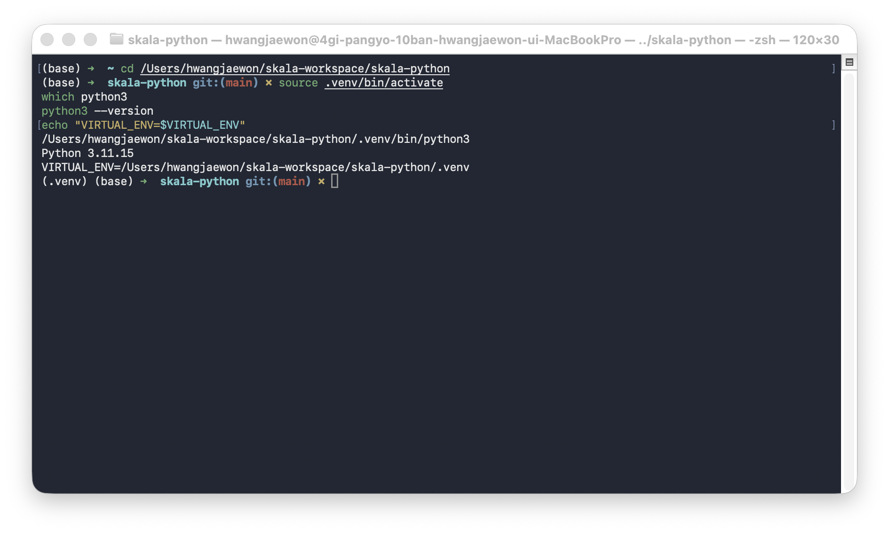
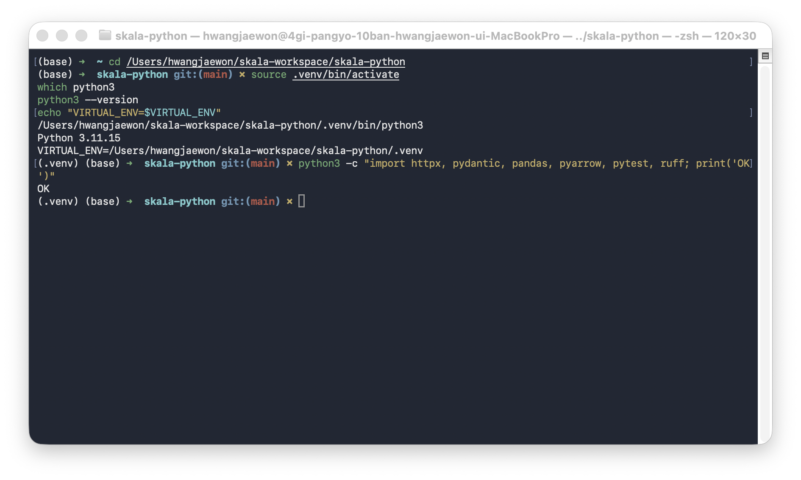
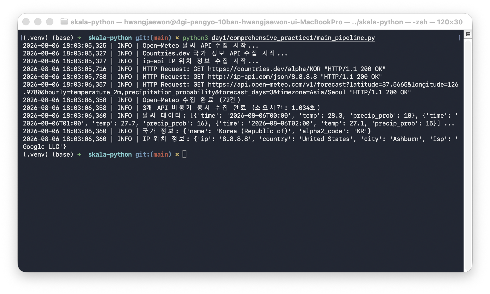
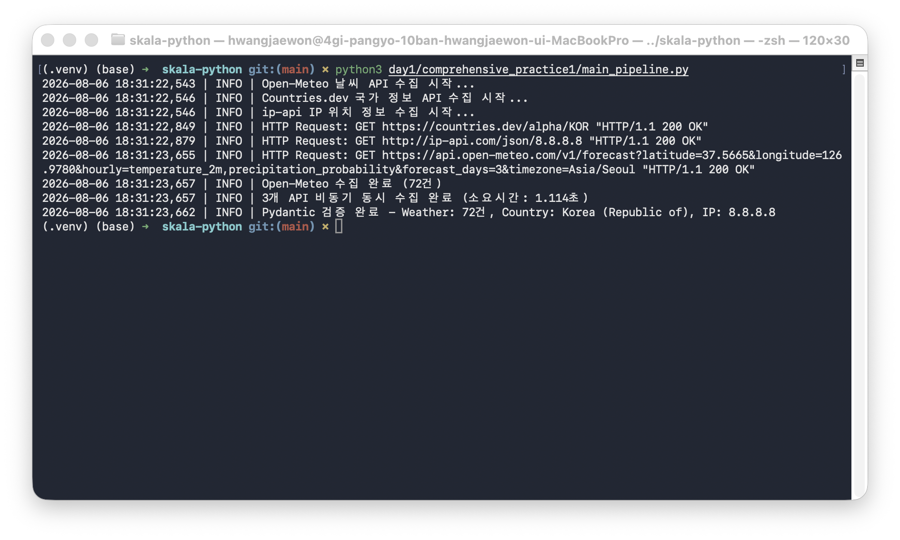
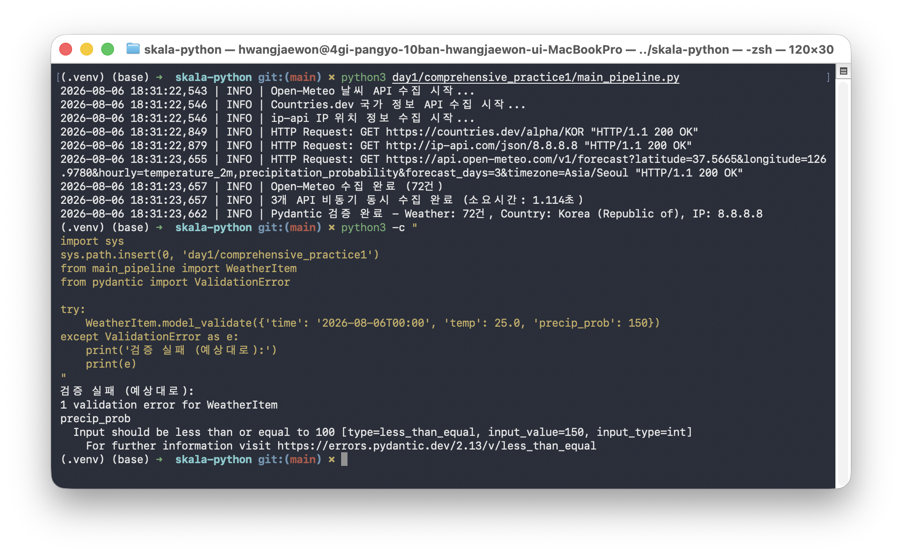
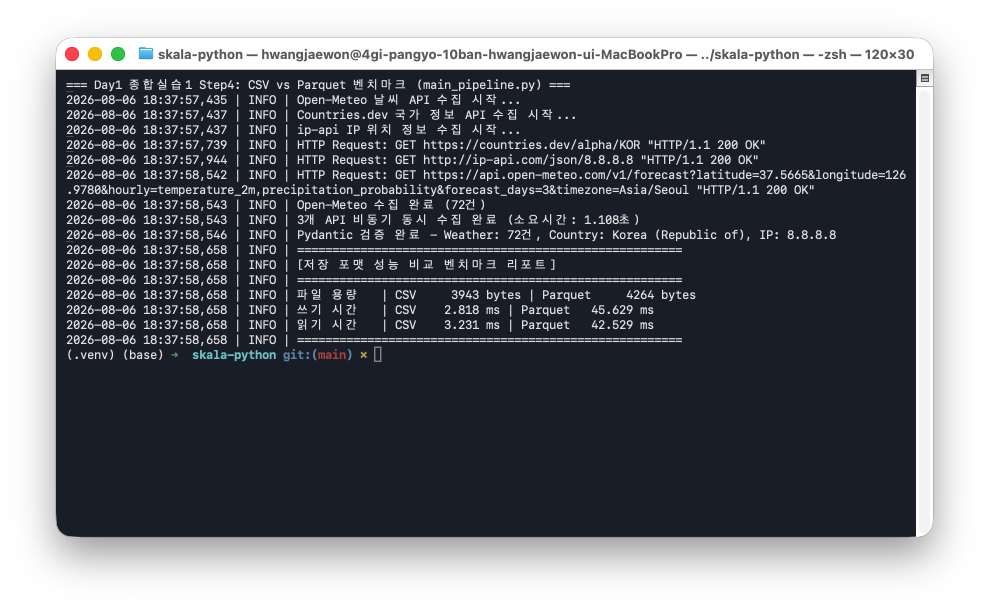
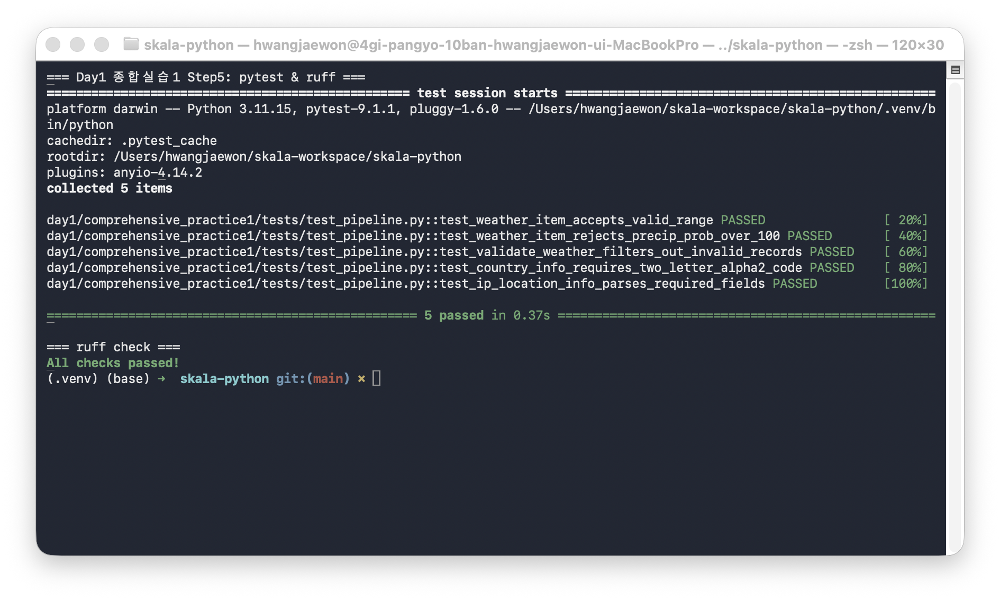

# Day1 종합 실습 1 — 데이터 수집 미니 파이프라인

가이드: `docs/Day1_종합_실습_1_가이드.md`
진행 과정의 의사결정·트러블슈팅 전체 기록: [`TROUBLESHOOTING.md`](./TROUBLESHOOTING.md)

## 실행 방법

```bash
# 저장소 루트 기준, .venv 활성화 필수
source .venv/bin/activate
python3 day1/comprehensive_practice1/main_pipeline.py

# 테스트
pytest day1/comprehensive_practice1/tests/ -v

# 린트
ruff check day1/comprehensive_practice1/
```

의존성은 저장소 루트 `requirements.txt`에 이미 포함되어 있다 (`httpx`, `pydantic`, `pandas`, `pyarrow`, `pytest`, `ruff`). `.venv`를 활성화하지 않으면 셸에 따라 다른 전역 Python이 잡힐 수 있으니 반드시 활성화 후 실행할 것.

## 파이프라인 구성

```
[Open-Meteo / Countries.dev / ip-api]
        │  asyncio.gather + httpx (동시 수집)
        ▼
   Pydantic v2 스키마 검증 (WeatherItem/CountryInfo/IPLocationInfo)
        ▼
   CSV / Parquet 저장 + 성능 벤치마크 (time.perf_counter)
```

## 실행결과 화면 Capture

### Step 1 — venv 활성화 및 의존성 확인

`.venv`를 명시적으로 활성화하지 않으면 셸에 따라 다른 전역 Python이 잡힐 수 있다는 점을 먼저 확인하고 시작했다.




### Step 2 — asyncio + httpx 비동기 동시 수집

3개 API(Open-Meteo, Countries.dev, ip-api)를 `asyncio.gather`로 동시 호출, 약 1초 만에 전부 수집 완료.



### Step 3 — Pydantic v2 스키마 검증

정상 데이터는 전부 검증 통과했고, 의도적으로 `precip_prob=150`(범위 초과) 더미 데이터를 넣어 `ValidationError`가 실제로 잡히는 것까지 확인했다.




### Step 4 — CSV vs Parquet 벤치마크

| 항목 | CSV | Parquet |
|---|---|---|
| 파일 용량 | 3,943 bytes | 4,264 bytes |
| 쓰기 시간 | 2.818 ms | 45.629 ms |
| 읽기 시간 | 3.231 ms | 42.529 ms |



### Step 5 — pytest + ruff

정상/경계값/실패 케이스를 섞은 테스트 5건 전부 통과, ruff 오류 0건.



## Code 분석 결과에 대한 본인 의견

- 가이드 4장의 레퍼런스 코드를 그대로 베끼지 않고, 프로젝트 코드 스타일 규칙(`.claude/rules/code-style.md`)에 맞춰 뜯어고치는 과정에서 규칙의 의도를 훨씬 잘 이해하게 됐다. 예를 들어 `Tuple` import 누락 같은 단순 실수뿐 아니라, `except Exception`으로 감싸고 하드코딩된 fallback을 반환하는 패턴이 왜 나쁜지(예외를 조용히 무마하면 실제 장애 상황을 놓친다), `print()` 대신 `logging`을 왜 써야 하는지를 직접 코드를 고치면서 체감했다.
- import 순서(`ruff`의 `I001`) 하나로도 두 번 걸렸다 — "표준 라이브러리 vs 서드파티" 그룹 구분뿐 아니라, 같은 그룹 안에서도 알파벳 순서를 지켜야 하고 그룹 내부에 불필요한 빈 줄이 있으면 안 된다는 것까지는 미처 몰랐던 디테일이었다. 린터가 이런 사소한 것까지 자동으로 잡아준다는 걸 실감했다.
- Pydantic v2의 `ge`/`le`, `min_length`/`max_length` 같은 제약은 선언만으로 검증 로직을 얻는다는 게 체감상 크게 다가왔다. 특히 일부러 범위를 벗어난 데이터를 넣어서 `ValidationError`가 실제로 발생하는 걸 눈으로 본 게, "검증 코드가 있다"와 "검증이 실제로 동작한다"의 차이를 확인시켜줬다.
- CSV vs Parquet 벤치마크에서 "Parquet이 무조건 빠르다"는 통념이 소규모 데이터(72건)에서는 정반대로 나온다는 걸 직접 측정해서 확인한 게 가장 인상 깊었다. 이론으로만 알던 것과 실측 수치로 확인하는 것의 차이를 느꼈다.

## 추가 의견 (개선 사항, 코드 품질 개선 측면 등)

- **재시도 로직**: 현재는 API 호출이 실패하면 즉시 예외가 전파된다. 실무라면 `tenacity` 같은 라이브러리로 지수 백오프 재시도를 추가해 일시적 네트워크 오류에 견고하게 만들 수 있다.
- **로깅 영구 저장**: 지금은 로그가 콘솔에만 출력된다. `RotatingFileHandler` 등으로 로그를 파일로 영구 저장하고, 검증 실패 레코드는 별도 dead-letter 파일로 분리하면 사후 추적이 쉬워질 것 같다.
- **Parquet 벤치마크 데이터 규모 확대**: 이번 실습 데이터(72건)로는 Parquet의 장점이 드러나지 않았다. 합성 데이터를 수만 건 이상으로 늘려 재비교하면 컬럼형 포맷의 실제 이점을 확인할 수 있을 것 같다.
- **테스트 커버리지 확장**: 현재 pytest는 Pydantic 모델 검증 위주다. `fetch_*` 함수들도 `httpx` 모킹(`respx` 등)으로 테스트하면 네트워크 계층까지 커버리지를 넓힐 수 있다.

## 알려진 제약

- Countries.dev API는 실행 시점의 실제 응답을 기준으로 스키마(`alpha2Code` 필드 등)를 확인했다. 외부 API이므로 향후 스펙이 바뀌면 재검증이 필요하다.
