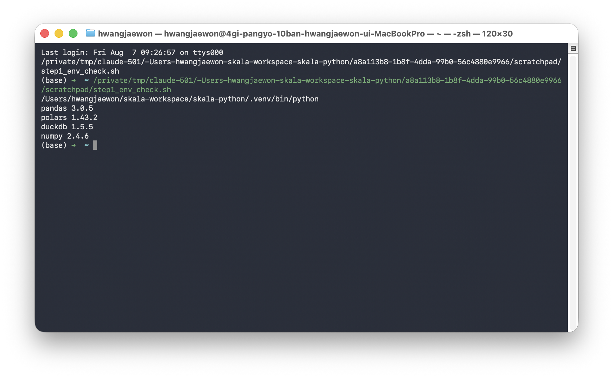
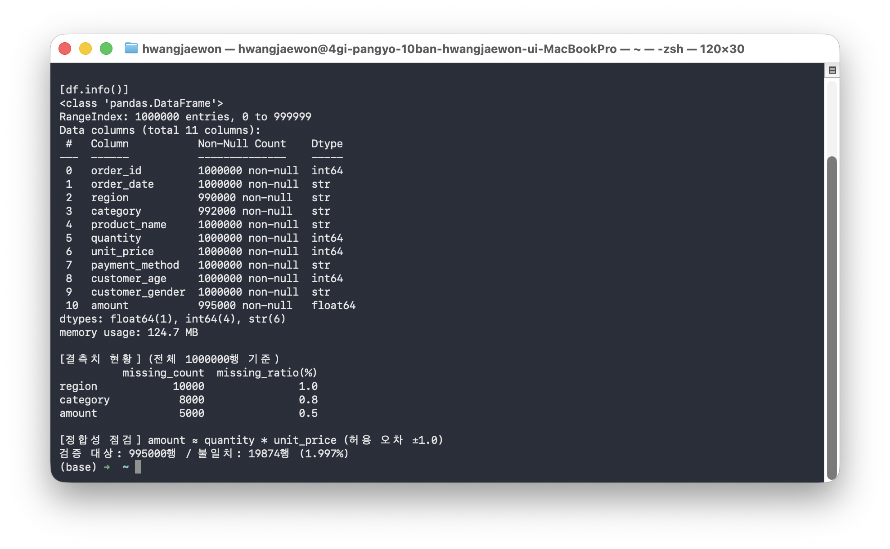
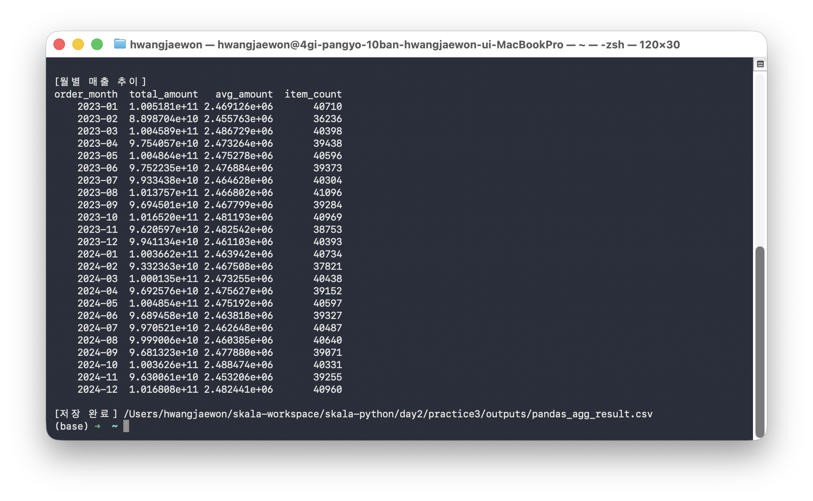
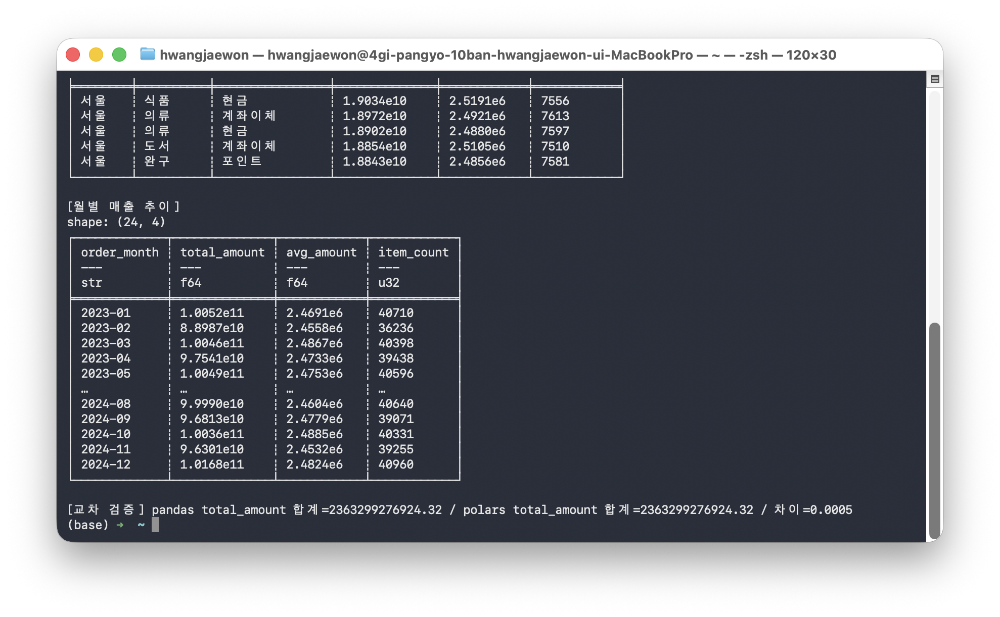
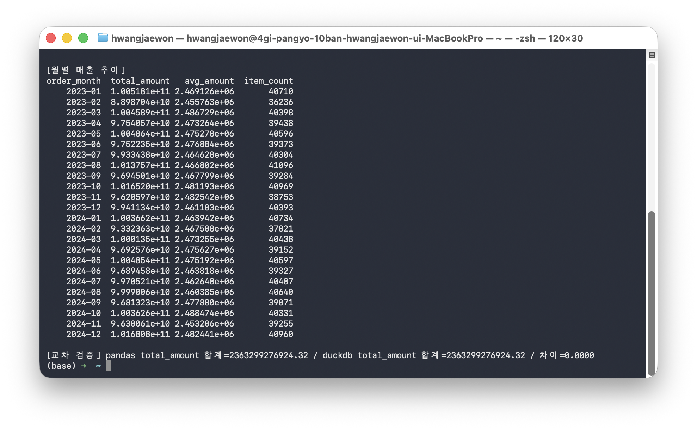
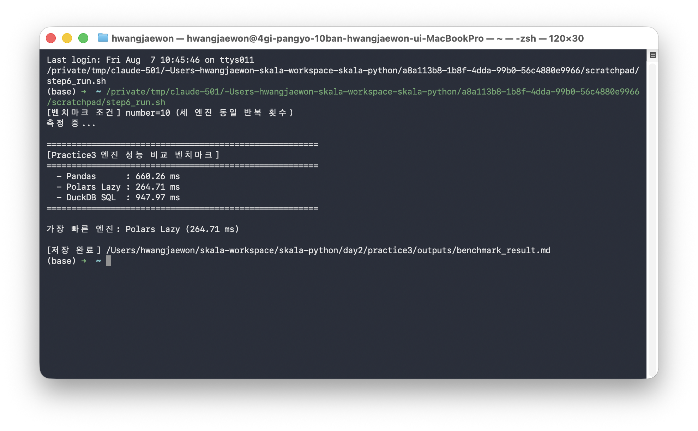

# Day2 Practice3 — Pandas / Polars / DuckDB 성능 비교

**작성자**: 황재원 (P345)
**작성일**: 2026-08-07

## 개요

`sales_100k.csv`(매출 데이터)를 대상으로 Pandas, Polars(Lazy API), DuckDB(SQL) 세 데이터
엔지니어링 도구로 동일한 전처리·집계 로직을 구현하고, 처리 성능을 `timeit`으로 비교했다.

## 데이터셋

| 항목 | 내용 |
|---|---|
| 경로 | `sales_100k.csv` (저장소 루트) |
| 행/열 | 1,000,000행 x 11열 |
| 컬럼 | `order_id, order_date, region, category, product_name, quantity, unit_price, payment_method, customer_age, customer_gender, amount` |
| 결측치 | `region` 10,000건(1.0%), `category` 8,000건(0.8%), `amount` 5,000건(0.5%) |

파일명은 10만 건을 암시하지만 실제로는 100만 건이며, 결측치가 포함된 실데이터라는 점을 Step2에서
직접 확인한 뒤 그에 맞춰 파이프라인을 설계했다.

## 처리 로직

세 엔진 모두 다음과 동일한 로직을 구현해 공정하게 비교했다.

1. **결측 제거**: `region`, `category`, `amount` 중 하나라도 결측인 행 제거 (1,000,000 → 977,140행)
2. **IQR 이상치 제거**: `amount` 기준 `Q1 - 1.5×IQR` ~ `Q3 + 1.5×IQR` 범위 밖 제거 (977,140 → 956,363행)
3. **region x category 집계**: Named Aggregation (`total_amount`=sum, `avg_amount`=mean, `item_count`=count), `total_amount` 내림차순 정렬
4. **payment_method 확장 집계**: `region x category x payment_method` 3단 집계 (실제 데이터에만 존재하는 컬럼 활용)
5. **월별 매출 추이**: `order_date`에서 연-월을 추출해 월별 집계

## 단계별 진행

| 단계 | 내용 | 스크립트 |
|---|---|---|
| Step1 | 환경 준비 (`.venv`에서 pandas/polars/duckdb 확인) | - |
| Step2 | 데이터 스키마/결측치 프로파일링 | `step2_data_profile.py` |
| Step3 | Pandas 파이프라인 (결측 제거 → IQR → 집계 3종) | `step3_pandas_pipeline.py` |
| Step4 | Polars Lazy 파이프라인 (`scan_csv` → `collect()`) | `step4_polars_pipeline.py` |
| Step5 | DuckDB SQL 파이프라인 | `step5_duckdb_pipeline.py` |
| Step6 | `timeit` 성능 벤치마크 (number=10) | `step6_benchmark.py` |

`_common.py`는 step2~5가 공통으로 사용하는 파일 로딩 예외처리 유틸리티다.

각 단계의 실행 로그는 `outputs/`에 텍스트로도 남아 있다. 진행 중 발생한 이슈는 `TROUBLESHOOTING.md`에 정리했다.

### 최종 제출 스크립트

`판교_10반_황재원.py`는 Step2~Step6의 로직을 하나로 합친 최종 스크립트로, 단독 실행만으로 프로파일링 →
Pandas/Polars/DuckDB 3엔진 파이프라인 → 교차 검증 → 성능 벤치마크까지 전 과정을 순서대로 수행한다.

```bash
source .venv/bin/activate
python day2/practice3/판교_10반_황재원.py
```

### 단계별 실행 캡처

**Step1 — 환경 준비**: `.venv`에서 pandas/polars/duckdb import 확인



**Step2 — 데이터 스키마/결측치 프로파일링**: `df.info()`, 결측 현황, amount 정합성 점검 결과



**Step3 — Pandas 파이프라인**: 결측/이상치 제거 통계와 집계 결과



**Step4 — Polars Lazy 파이프라인**: 동일 로직 실행 결과 및 Pandas 대비 교차 검증



**Step5 — DuckDB SQL 파이프라인**: SQL 집계 결과 및 Pandas 대비 교차 검증



**Step6 — 성능 벤치마크**: 세 엔진 평균 소요시간 비교



## 결과 일치 검증

세 엔진의 `region x category` 집계 `total_amount` 합계를 비교한 결과:

| 비교 | total_amount 합계 차이 |
|---|---|
| Pandas vs Polars | 0.0005 |
| Pandas vs DuckDB | 0.0000 |

부동소수점 합산 순서에 따른 미세한 오차를 제외하면 세 엔진의 처리 결과는 완전히 동일하다.

## 성능 벤치마크 결과

`timeit.timeit(number=10)`으로 측정한 평균 소요시간:

| 엔진 | 평균 소요시간(ms) | 반복 횟수 |
|---|---|---|
| Polars Lazy | 264.71 | 10 |
| Pandas | 660.26 | 10 |
| DuckDB SQL | 947.97 | 10 |

- **Polars Lazy**가 가장 빠르다. `scan_csv`의 지연 평가로 filter/group_by가 스캔 단계에서 함께
  최적화(predicate/projection pushdown)되기 때문으로 볼 수 있다.
- **Pandas**는 CSV 전체를 즉시 메모리에 적재한 뒤 처리하는 Eager 방식으로, Polars보다 느리지만
  DuckDB보다는 빠르다.
- **DuckDB**는 이번 파이프라인에서 프로파일링(결측/사분위수 계산) 쿼리와 3종 집계 쿼리를 합쳐 총
  5개의 SQL을 매 반복마다 실행하며, 매 쿼리가 CSV 파일을 다시 스캔하는 구조라 다른 두 엔진보다
  전체 소요시간이 길게 측정되었다. 단일 쿼리로 결과를 캐싱하거나 파일을 DuckDB 테이블로 먼저
  적재했다면 결과가 달라질 수 있다.

## 코드 리뷰 후속 개선

실습 Checkpoint 배점표(오류/예외 처리, 코드 간결성) 기준으로 코드 리뷰를 진행한 결과 두 가지를 보완했다.

- **파일 로딩 예외처리**: CSV 파일이 없거나 손상된 경우 각 라이브러리의 원본 traceback 대신 명확한
  메시지로 실패하도록 `_common.py`의 `ensure_csv_exists()`와 라이브러리별 예외 변환을 추가했다.
- **집계 함수 중복 제거**: `step3`/`step4`/`step5`에서 group 컬럼만 다르고 구조가 동일했던
  `agg_region_category`/`agg_payment_method`(/월별 집계)를 각 파일 내 공통 헬퍼로 통합했다.

리팩터링 전후로 처리 로직과 결과 수치는 동일하며(재실행 결과를 기존 로그와 diff로 검증), 상세 경위는
`TROUBLESHOOTING.md`에 기록했다.

## 결론

동일 데이터·동일 로직 기준으로는 Lazy 평가와 쿼리 최적화를 지원하는 Polars가 가장 효율적이었고,
Pandas는 준수한 처리 속도를 보였다. DuckDB는 SQL 인터페이스의 편의성은 있으나 이번 측정 조건(반복
쿼리마다 파일 재스캔)에서는 가장 느리게 나타났으며, 실제 운영 환경에서는 테이블 적재 후 쿼리하는
방식으로 비교하면 다른 결과가 나올 수 있다.
