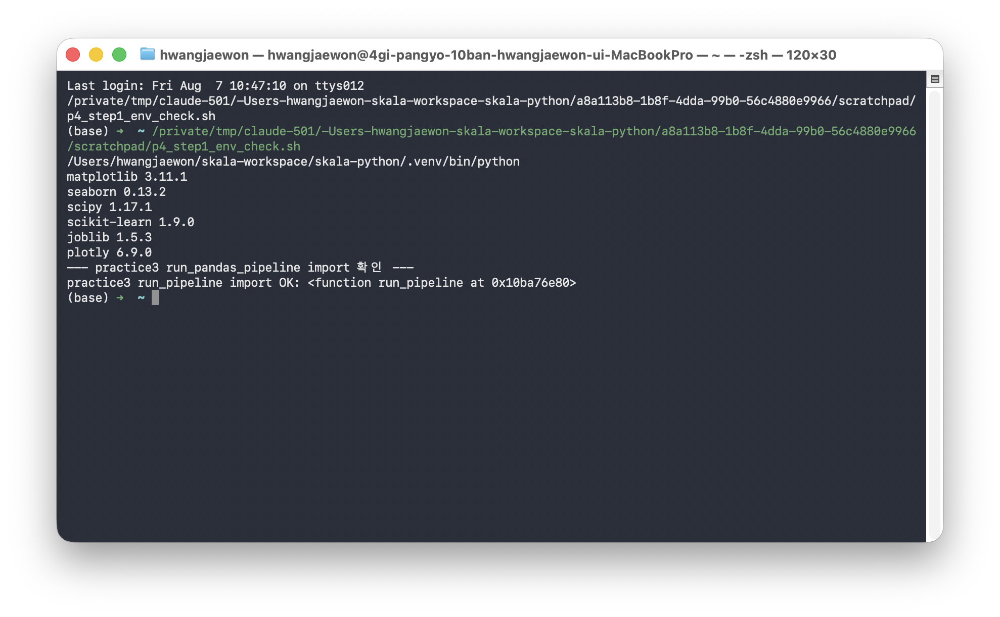
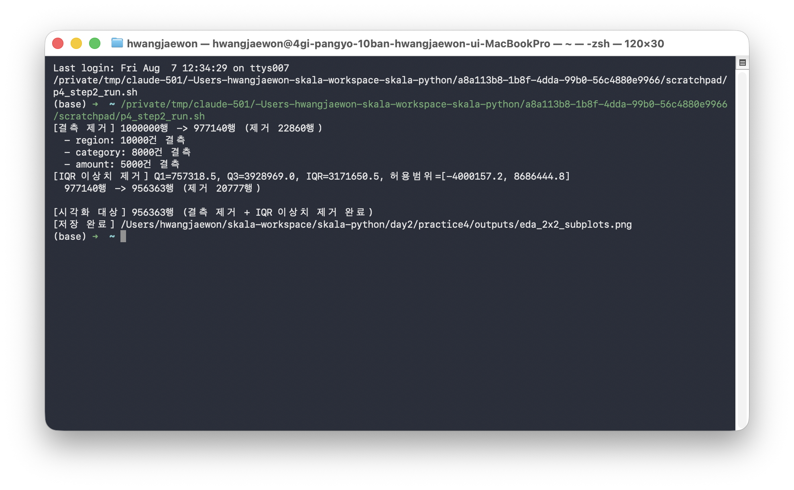
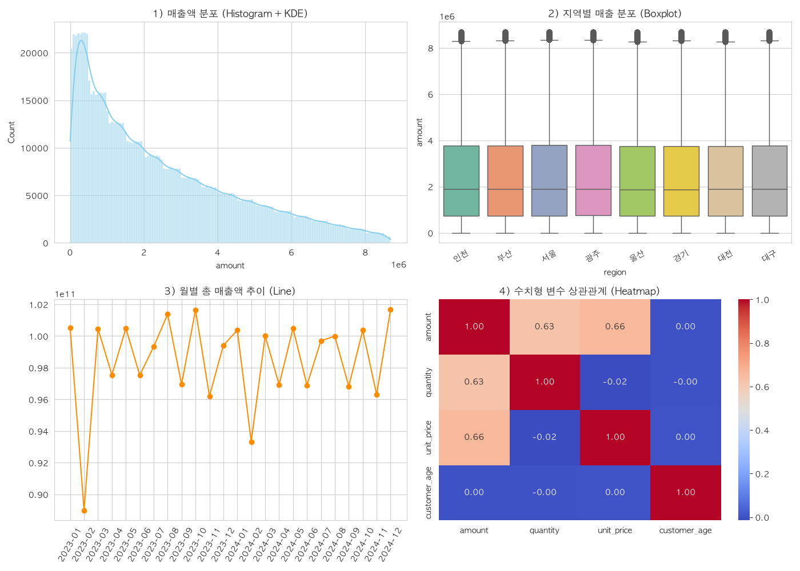
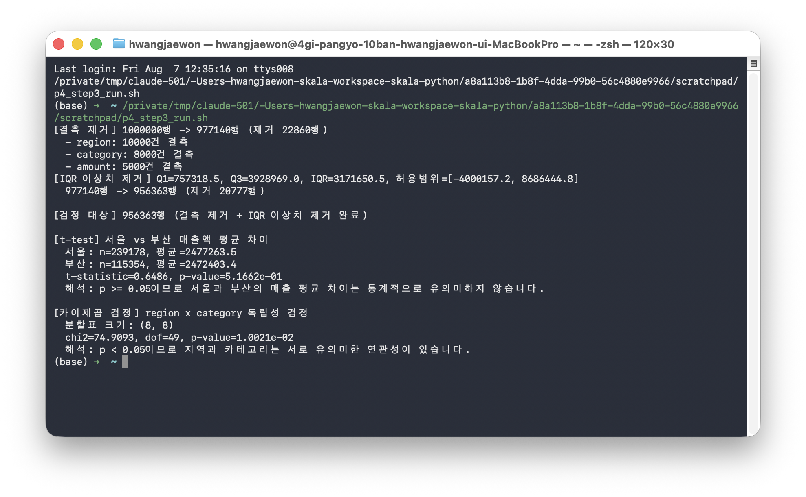
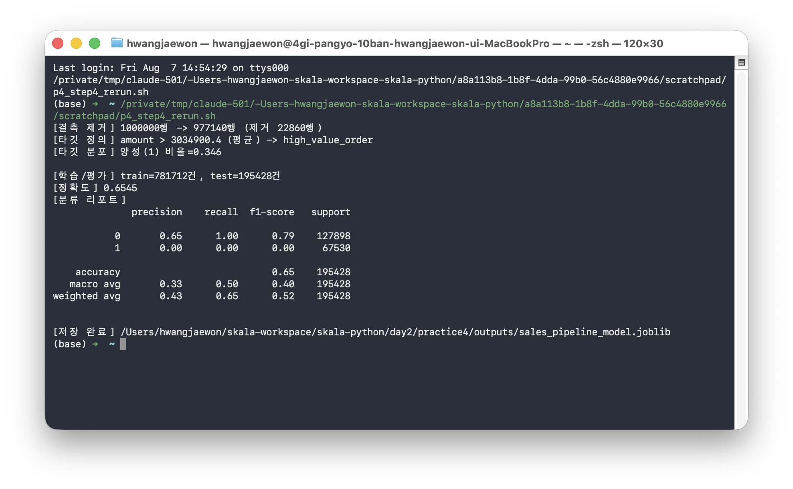
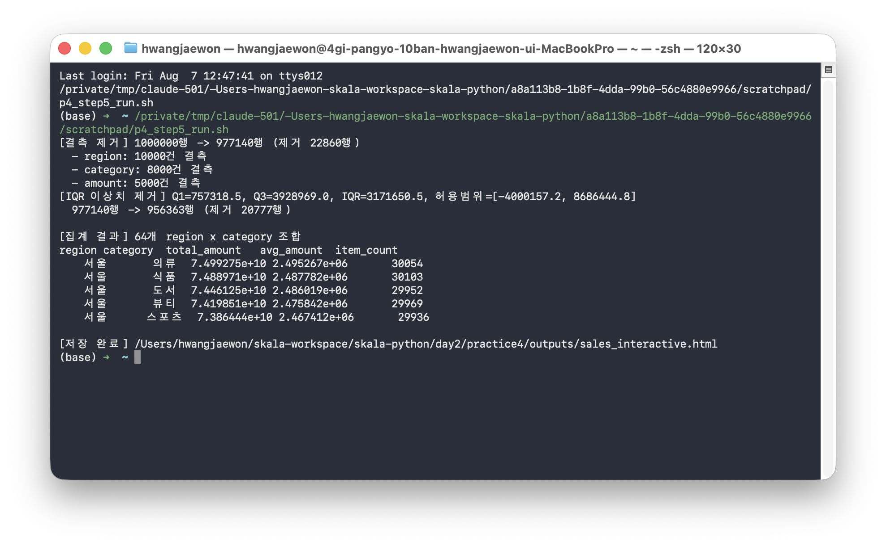

# Day2 Practice4 — 시각화 4종 · 통계 검정 · sklearn Pipeline · Plotly

**작성자**: 황재원 (P345)
**작성일**: 2026-08-07

## 개요

`sales_100k.csv`(매출 데이터)를 대상으로 2x2 서브플롯 EDA 시각화, t-test/카이제곱 통계 검정,
`ColumnTransformer` + 분류 모델 `Pipeline` 구축·저장, Plotly 인터랙티브 차트를 구현했다.
[Day2 Practice3](../practice3/README.md)의 결측 제거·IQR 이상치 제거 파이프라인을 입력 데이터로
재사용해 두 실습 간 연계 구조를 만족한다.

## practice3 연계 구조

| practice3 산출물 | practice4 활용 |
|---|---|
| 결측 제거 + IQR 이상치 제거 DataFrame | Step2 시각화, Step3 통계 검정의 입력 데이터 |
| region x category Named Aggregation | Step3 카이제곱 분할표 구성 관점, Step5 Plotly 차트 데이터 |
| `sales_100k.csv` 원본 | Step4 sklearn Pipeline의 학습 데이터 원본 |

개별 step 스크립트는 `day2/practice3/step3_pandas_pipeline.py`의 함수를 직접 import해서 재사용하며
(`_common.py` 참고), 결측 제거·IQR 로직을 중복 구현하지 않는다. 다만 최종 제출 스크립트
`판교_10반_황재원.py`는 다른 디렉토리에 의존하지 않도록 해당 로직을 자체적으로 포함한다.

## 단계별 진행

| 단계 | 내용 | 스크립트 |
|---|---|---|
| Step1 | 환경 준비 (matplotlib/seaborn/scipy/scikit-learn/joblib/plotly 확인) | - |
| Step2 | EDA 시각화 4종 (2x2 서브플롯) | `step2_eda_visualization.py` |
| Step3 | 통계 검정 (t-test + 카이제곱) | `step3_statistical_tests.py` |
| Step4 | sklearn Pipeline 구축·저장 | `step4_ml_pipeline.py` |
| Step5 | Plotly 인터랙티브 차트 | `step5_plotly_chart.py` |

`_common.py`는 파일 로딩 예외처리와 practice3 파이프라인 재사용을 담당하는 공용 유틸리티다.
각 단계의 실행 로그는 `outputs/`에 텍스트로도 남아 있다. 진행 중 발생한 이슈는
[`TROUBLESHOOTING.md`](./TROUBLESHOOTING.md)에 정리했다.

### 단계별 실행 캡처

**Step1 — 환경 준비**: 필요 패키지 import 및 practice3 파이프라인 재사용 가능 확인



**Step2 — EDA 시각화 4종**: 히스토그램+KDE / 박스플롯 / 월별 라인차트 / 상관관계 히트맵



2x2 서브플롯 이미지 원본:



**Step3 — 통계 검정**: t-test / 카이제곱 검정 결과 및 유의성 해석



**Step4 — sklearn Pipeline**: 학습/평가 결과 및 모델 저장



**Step5 — Plotly 인터랙티브 차트**: region x category 매출 집계 및 HTML 저장



### 최종 제출 스크립트

`판교_10반_황재원.py`는 Step2~Step5의 로직을 하나로 합친 최종 스크립트다. practice3 코드에
의존하지 않도록 결측 제거+IQR 이상치 제거 로직을 자체적으로 포함하며, 단독 실행만으로
시각화 → 통계 검정 → Pipeline 학습/저장 → Plotly 차트까지 전 과정을 순서대로 수행한다.
실행 결과(통계량, 정확도, 산출 파일)는 개별 step 스크립트 실행 결과와 완전히 동일함을 확인했다.

```bash
source .venv/bin/activate
python day2/practice4/판교_10반_황재원.py
```

## 통계 검정 결과

| 검정 | 통계량 | p-value | 해석 |
|---|---|---|---|
| t-test (서울 vs 부산) | t = 0.6486 | 0.5166 | p ≥ 0.05 → 두 지역 매출 평균 차이는 유의미하지 않음 |
| 카이제곱 (region x category) | χ² = 74.9093 (dof=49) | 0.0100 | p < 0.05 → 지역과 카테고리는 유의미한 연관성 있음 |

## sklearn Pipeline 결과

- **피처**: `region`/`category`/`payment_method`(OneHotEncoder), `quantity`/`unit_price`/`customer_age`(StandardScaler)
- **타깃**: `high_value_order` = `amount > 평균(amount)` (양성 비율 34.6%). 타깃 산정에 쓴 `amount`
  자체는 데이터 누수 방지를 위해 피처에서 제외했다.
- **모델**: `RandomForestClassifier(n_estimators=100, max_depth=15, min_samples_leaf=50)`
- **정확도**: 0.9831 (test 195,428건 기준)
- **저장 파일**: `outputs/sales_pipeline_model.joblib` (37MB. 트리 깊이 제한 전에는 약 500MB였음 —
  자세한 경위는 TROUBLESHOOTING.md 참고)

## Plotly 인터랙티브 차트

`outputs/sales_interactive.html`은 region x category 매출 합계를 그룹 바 차트로 보여주는 인터랙티브
HTML이다. 브라우저로 직접 열어 지역/카테고리별 막대에 마우스를 올리면 수치를 확인할 수 있다.

## Checkpoint 대조

| 검증 항목 | 결과 |
|---|---|
| `fig, axes = plt.subplots(2, 2)` 단일 figure 4개 차트 | 충족 (`step2_eda_visualization.py`) |
| t-test/카이제곱 p-value 유의성 해석 문구 | 충족 (`interpret_p_value()`) |
| `sklearn.pipeline.Pipeline` 객체 사용 (전처리+모델 통합) | 충족 (`build_pipeline()`) |
| `joblib.dump()`로 모델 파일 저장 | 충족 (`sales_pipeline_model.joblib`) |
| `fig.write_html()`로 Plotly HTML 저장 | 충족 (`sales_interactive.html`) |

## 결론

practice3의 정제 파이프라인을 그대로 재사용해 시각화·통계 검정을 수행함으로써 두 실습 간 데이터
일관성을 확보했다. 통계적으로 서울-부산 매출 평균 차이는 유의하지 않았지만 지역-카테고리 조합은
유의미한 연관성을 보였다. sklearn Pipeline은 가이드 예시의 데이터 누수를 피해 재설계했고, 트리
깊이를 제한해 실용적인 크기(37MB)의 모델 파일을 얻었다.
