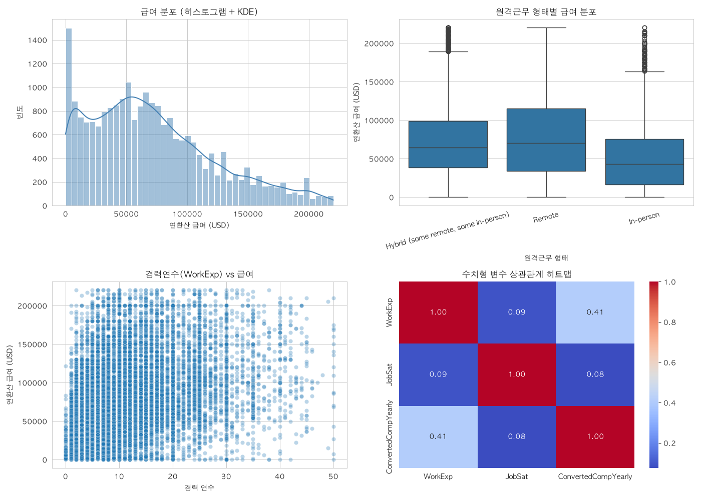
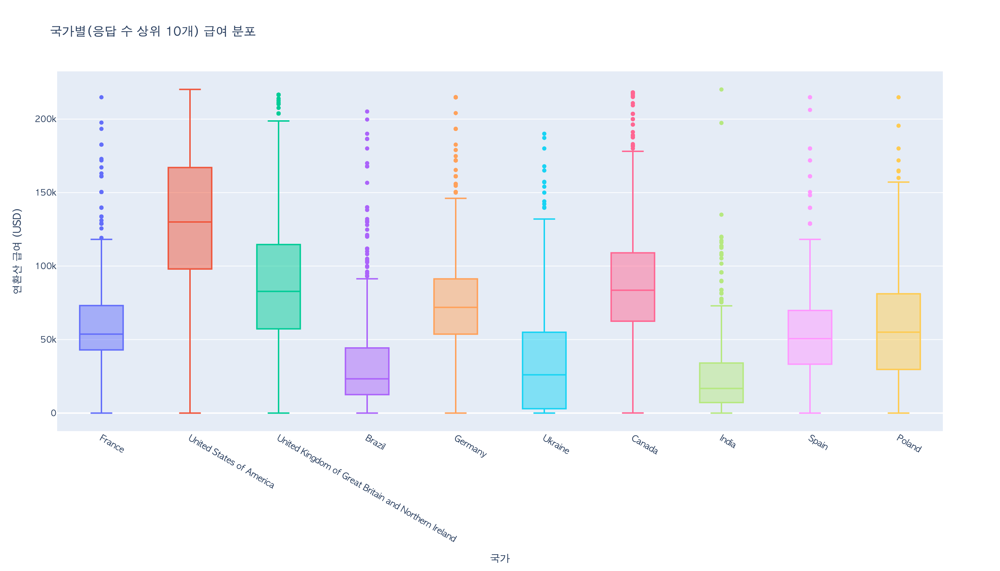

# Day2 종합 실습 2 — Stack Overflow Developer Survey 2024 개발자 급여 분석

**작성자**: 황재원 (P345)
**작성일**: 2026-08-07

## 개요

Stack Overflow Developer Survey 2024 원본 데이터(`results.csv`, 약 152MB, 114개 컬럼)를 대상으로
Pandas·Polars 로딩 비교, EDA, 결측/이상치 정제, 시각화(Seaborn+Plotly), 통계 검정(t-test),
scikit-learn Pipeline(회귀+분류) 모델링, `report.md` 자동 생성까지의 End-to-End 파이프라인을 구현한다.
급여 지표는 `ConvertedCompYearly`(USD 연환산)를 사용하며, 문서 전반에서 "급여"로 표기를 통일한다.

## 진행 단계

| Step | 내용 | 모듈 | 상태 |
|---|---|---|---|
| 0 | Pandas·Polars 양쪽 로딩 후 행·열 수와 로딩 결과 비교 | `src/data_loader.py` | 완료 |
| 1 | 원본 데이터 EDA (Pandas 상세 + Polars 결측률 이중 집계) | `src/eda.py`, `src/eda_polars.py` | 완료 |
| 2 | 결측치·중복·급여 이상치 처리 | `src/preprocessing.py` | 완료 |
| 3 | 정제 데이터 EDA 및 기술통계 | `src/eda.py` | 완료 |
| 4 | 급여와 수치형 변수의 상관관계 분석 | `src/eda.py` | 완료 |
| 5 | 범주형 변수별 급여 중앙값·분포 비교 (Pandas + Polars 교차검증) | `src/eda.py`, `src/eda_polars.py` | 완료 |
| 6 | 모델용 컬럼 선택 | `src/preprocessing.py` | 완료 |
| 7 | Seaborn·Plotly 시각화 | `src/visualization.py` | 완료 |
| 8 | t-test 및 p-value 해석 | `src/statistics.py` | 완료 |
| 9 | Pipeline 모델 학습·평가·저장 | `src/modeling.py` | 완료 |
| 10 | report.md 자동 생성 | `main.py` | 완료 |

각 단계 실행 결과 로그는 `outputs/logs/`에, 실행 화면 캡처는 아래 섹션에 이어서 임베드한다.
진행 중 발생한 이슈는 [`TROUBLESHOOTING.md`](./TROUBLESHOOTING.md)에 정리한다.

## 정제 기준 (Step 2)

- **급여 결측**: `ConvertedCompYearly` 결측 행(64.2%)은 제거. 응답이 없는 행을 억지로 채우면 왜곡이
  더 크다고 판단해 제거를 선택했다.
- **경력 텍스트 변환**: `YearsCode`/`YearsCodePro`의 `"Less than 1 year"` → 0, `"More than 50 years"` → 51로
  매핑하고 나머지는 정수 문자열을 그대로 숫자로 변환.
- **급여 이상치**: IQR 규칙(`Q1 - 1.5*IQR` ~ `Q3 + 1.5*IQR`)으로 제거.

원본 65,437행 → 급여 결측 제거 23,435행 → 완전 중복 0행 제거 → IQR 이상치 978행 제거 →
**최종 22,457행**(원본 대비 34.3%)이 정제 데이터로 확정됐다.

## 원본 데이터

- 출처: `https://github.com/StackExchange/Survey/raw/refs/heads/main/packages/archive/2024/results.csv`
- `main.py` 최초 실행 시 `data/raw/results.csv`가 없으면 자동 다운로드되어 캐시된다(용량이 커 git에는 포함하지 않음).

## 실행 방법

```bash
source .venv/bin/activate
python day2/판교_10반_황재원_day2종합실습/main.py
```

## 단계별 실행 캡처

**Step0~1 — Pandas/Polars 로딩 비교 및 원본 EDA**

원본 CSV(65,437행 x 114열)를 두 엔진으로 로딩한 결과 행·열 수가 완전히 일치했다. Polars가
Pandas보다 로딩 시간·메모리 양쪽에서 더 가벼웠다(Pandas 195.7MB/1.2초 vs Polars 144.5MB/0.5초).
급여 타깃(`ConvertedCompYearly`)은 결측률이 64.2%로 매우 높고, `YearsCode`/`YearsCodePro`는
숫자가 아닌 문자열(`str`) dtype이라 정제 단계에서 수치 변환이 필요함을 확인했다. 전체 로그는
[`outputs/logs/step1_raw_eda.txt`](outputs/logs/step1_raw_eda.txt)에서 확인할 수 있다.

**Polars는 로딩 비교로만 끝내지 않고 EDA에도 실제로 사용했다.** Step 0에서 로딩한 Polars
DataFrame을 그대로 재사용해 Step 1(결측률 집계, `outputs/logs/step1_raw_eda_polars.txt`)과
Step 5(급여 정제 + 범주형 그룹 비교, `outputs/logs/step5_categorical_groups_polars.txt`)를
Polars Lazy API로 이중 수행하고, Pandas 결과와 대조하는 교차검증을 넣었다(`src/eda_polars.py`).
정제 후 행 수(22,457행)와 `RemoteWork` 그룹 급여 중앙값이 두 엔진에서 정확히 일치함을 확인했다.

두 엔진 결과를 직접 비교하는 과정에서 결측률 수치가 처음엔 크게 어긋났다(`AINextMuch less
integrated` 기준 Pandas 98.2% vs Polars 50.5%). 원인은 원본 CSV의 결측 표시 문자열 `"NA"`를
Pandas `read_csv`는 기본으로 결측 처리하지만 Polars `read_csv`는 하지 않는 차이였다.
`load_with_polars()`에 `null_values=["NA"]`를 추가해 두 엔진의 결측 판정 기준을 통일했고,
재실행 후 Step 1 결측률 상위 15개 컬럼이 완전히 일치함을 확인했다(자세한 원인 분석은
[`TROUBLESHOOTING.md`](./TROUBLESHOOTING.md) 참고).

```text
=== Step 0: Pandas vs Polars 로딩 비교 ===
엔진               행 수     열 수        로딩 시간(초)       메모리(MB)
pandas         65437     114           1.248         195.7
polars         65437     114           0.511         144.5
[data_loader] 행·열 수 일치 확인 완료.

[타깃: ConvertedCompYearly]
  결측 수: 42002 / 65437 (64.2%)
  분위수:
    0.01: 208
    0.25: 32,712
    0.50: 65,000
    0.75: 107,972
    0.99: 393,751

[수치형 후보 컬럼 dtype/샘플]
  YearsCode: dtype=str, 샘플=['20', '37', '4', '9', '10']
  YearsCodePro: dtype=str, 샘플=['17', '27', '7', '11', '25']
  WorkExp: dtype=float64
  JobSat: dtype=float64
```

**Step2~5 — 정제, 정제 EDA, 상관분석, 범주형 그룹 비교**

정제 후 `WorkExp`(경력 연수)가 급여와 가장 강한 상관관계(r=0.408)를 보였고, `YearsCodePro`(0.400)·
`YearsCode`(0.398)가 뒤를 이었다. `JobSat`(직무 만족도)은 급여와 거의 무관했다(r=0.075) — 급여가
높다고 만족도가 비례해 오르지 않는다는 뜻이다. 범주형 비교에서는 국가별(미국 $130,000 vs 평균 근접국
대비 큰 격차), 원격근무 형태별(Remote > Hybrid > In-person 순), 학력별(전문학위 > 석사 > 학사 순)로
급여 중앙값이 뚜렷하게 갈렸다. 전체 로그는 [`outputs/logs/`](outputs/logs/)의 step2~5 파일에서 확인할 수 있다.

```text
=== Step 2: 결측치·중복·급여 이상치 처리 ===
[시작] 65437행
[1] 급여(ConvertedCompYearly) 결측 행 제거 → 23435행 (제거 42002행)
[2] 완전 중복 행 제거 → 23435행 (제거 0행)
[3] YearsCode/YearsCodePro 텍스트→숫자 변환 완료 (변환 후 결측: {'YearsCode': 47, 'YearsCodePro': 90})
[4] 급여 IQR 이상치 제거 → 22457행 (제거 978행, 경계=[-80,177, 220,861])
[완료] 최종 22457행 (원본 대비 34.3%)

=== Step 4: 급여와 수치형 변수의 상관관계 분석 ===
[ConvertedCompYearly와의 상관계수 (절댓값 내림차순)]
  WorkExp: 0.4084
  YearsCodePro: 0.4002
  YearsCode: 0.3983
  JobSat: 0.0752

=== Step 5: 범주형 변수별 급여 중앙값·분포 비교 (상위 3개 그룹만 발췌) ===
[Country] United States of America $130,000 / Israel $113,334 / Switzerland $111,417
[RemoteWork] Remote $70,000 / Hybrid $64,444 / In-person $42,962
[EdLevel] 전문학위(JD/MD/PhD 등) $75,184 / 석사 $65,271 / 학사 $64,444
```

**Step6~10 — 피처 선택, 시각화, t-test, ML Pipeline, report.md 자동 생성**

- Step6: 수치형 2개(`WorkExp`, `JobSat`) + 범주형 5개(`Country`, `RemoteWork`, `EdLevel`, `OrgSize`,
  `Industry`)를 모델 피처로 확정. `DevType`/`Employment`는 고유값이 지나치게 많고 상위 카테고리
  집중도가 낮아 제외, `CompTotal`/`Currency`는 급여에서 직접 파생돼 타깃 누수 위험이 있어 애초에
  후보에서 제외했다. `YearsCode`/`YearsCodePro`는 애초 4개 수치형 피처로 함께 채택했었으나,
  `WorkExp`와 VIF(분산팽창지수) 6.2~10.6으로 다중공선성이 심각해 급여 상관·VIF가 가장 우수한
  `WorkExp`만 남기고 제외했다(자세한 내용은 [`TROUBLESHOOTING.md`](./TROUBLESHOOTING.md) 참고).
- Step7: Seaborn 2x2 서브플롯(급여 분포/원격근무별 박스플롯/경력-급여 산점도/상관 히트맵)과, 국가별(응답
  상위 10개국) 급여 분포 Plotly 인터랙티브 박스플롯을 생성했다.
  
  Plotly 차트는 HTML이라 GitHub에서 바로 렌더링되지 않아 `kaleido`로 정적 PNG 미리보기도 함께
  생성했다(`create_plotly_chart(..., preview_path=...)`, `src/visualization.py`).
  
  인터랙티브 HTML 원본: [`outputs/html/salary_by_country.html`](outputs/html/salary_by_country.html)
- Step8: Remote(원격) vs In-person(사무실 근무) 급여 평균을 독립표본 t-검정(Welch's t-test)했다.
  p-value가 $3.2 \times 10^{-164}$로 0.05보다 훨씬 작아 두 그룹의 평균 급여 차이는 통계적으로 유의하다.
- Step9: `ColumnTransformer`(수치형 결측대체+표준화, 범주형 결측대체+원핫인코딩) + `RandomForest`
  Pipeline을 회귀(급여 예측)·분류(중앙값 기준 고액 여부) 두 가지로 각각 구축·평가·저장했다.
- Step10: 위 결과를 종합해 [`report.md`](report.md)를 자동 생성했다.

```text
=== Step 8: t-test (Remote vs In-person 급여 비교) ===
[Remote] n=9039, 평균=78,720
[In-person] n=3833, 평균=52,638
t-통계량=27.8965, p-value=3.22365e-164
[해석] p-value(3.22365e-164) < 0.05 → 귀무가설(두 그룹의 급여 평균이 같다) 기각.
       Remote 근무자와 In-person 근무자의 평균 급여 차이는 통계적으로 유의하다.

=== Step 9: Pipeline 모델 학습·평가·저장 ===
[회귀] R²=0.5370, MAE=25,635
[분류] 고액 급여 기준(중앙값)=63,694
[분류] Accuracy=0.7861, F1-score=0.7781
```

다중공선성 피처(`YearsCode`/`YearsCodePro`) 제거 후 회귀 R²(0.5879→0.5370)·분류 F1(0.7914→0.7781)이
소폭 낮아졌다 — 중복 신호가 줄어든 데 따른 자연스러운 트레이드오프이며, 분류 Accuracy는 0.7861로
변화가 없었다.
